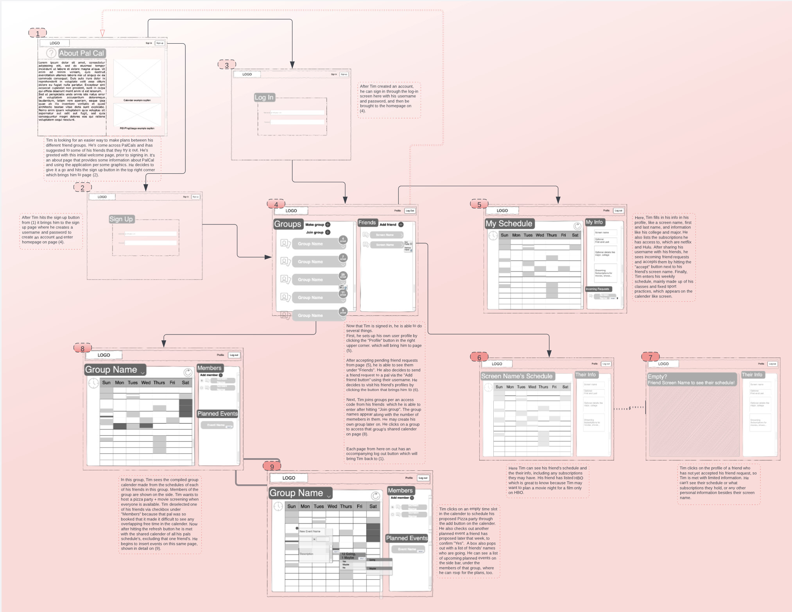
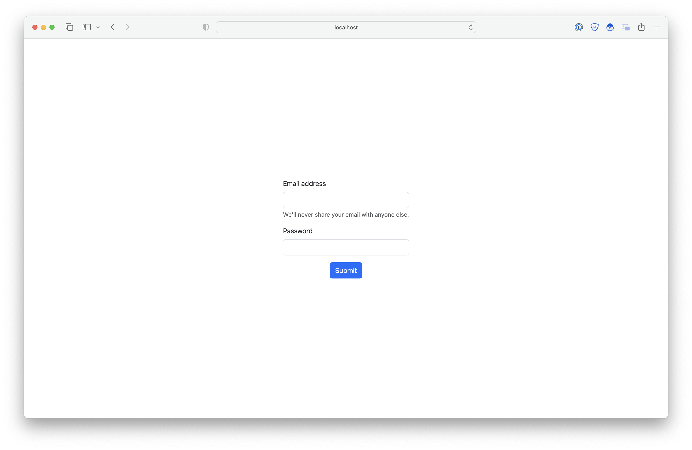

# UI Design

## Wireframe

When accessing the page for the first time while logged out, information about the app is displayed

You sign up or log in to Pal Cal with a username and password

 
On logging in, a main view displays all of your groups and friends

From the home page, you can access your profile to view and edit your schedule and profile data like username and biographical info

Selecting someone else's profile will display their information only if they are a friend

Clicking through from the home page to a group shows the overlapping free time of all group members, and has interfaces to filter group members and propose events

## Stories

[Click to view](https://lucid.app/documents/embedded/d1f67a46-46cb-4135-924e-3ee4e8815a8f)

## HTML & CSS Mockup

The initial screen when logged out

The login or sign up screen

Viewing your profile

The main home page after logging in

